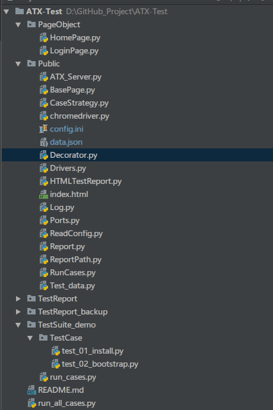
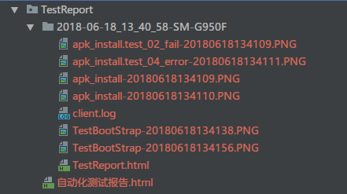
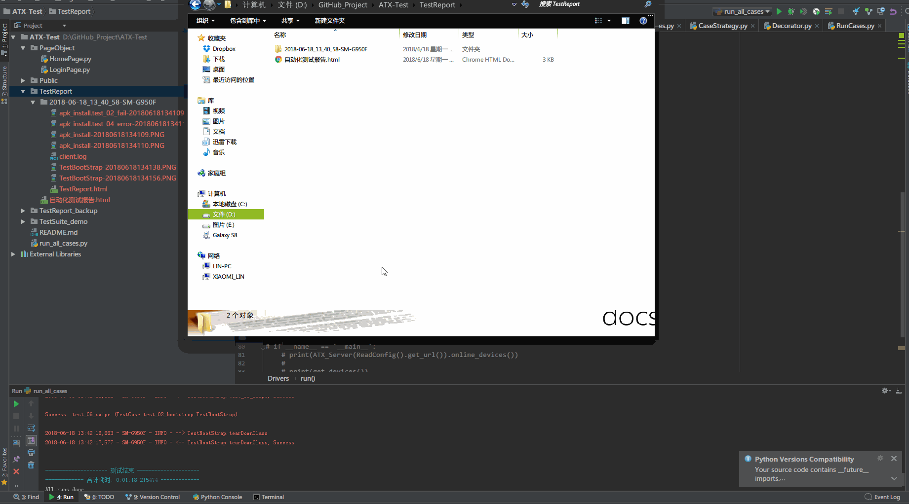

基于ATX-Server的UI自动化测试框架，可以实现多设备的并行测试，并生成统一的测试报告
python2不支持 需要再python3上运行  本人python版本 3.6

#### 前置条件
Android设备需要通过uiautomator2 init 初始化完成，确认可以正常连接 ，或者init 接入atx-server
uiautomator版本需 Version: 0.1.3.dev5 及以后

需要依赖的python第三方库 tinydb、uiautomator2、selenium、jinja2、psutil

相关的基础链接如下

[小白入门篇：python uiautomator2 的代码示例]( https://testerhome.com/topics/12521)

[浅谈自动化测试工具 python-uiautomator2](https://testerhome.com/topics/11357)

[atx 安卓集群管理 安装运行及自动化的实践](https://testerhome.com/topics/11588)

[ATX-uiautomator2 实现 webview 的操作](https://testerhome.com/topics/12599)


#### 先行声明：

1.下面展示的内容多源于TesterHome各位前辈的经验总结，我只是按照我的想法进行了简单拼接（基于ATX-uiautomator2的android自动化测试）

2.主要参考了hualin (王华林) 老师的https://testerhome.com/topics/7550  ，并在此基础上结合uiautomator2实现

3.所用语言为Python，测试报告模板借用了https://github.com/Gelomen/HTMLTestReportCN-ScreenShot  ，并进行了简单的修改以方便截图

4.使用了macaca的bootstrap app作为demo演示

#### 工程介绍

工程目录如下



主体结构和hualin (王华林) 老师的https://testerhome.com/topics/7550  的一致，主要修改了Pubilc下一些东西，并增加了一些东西

**Public：** 

- Devices_new.py 获取atx-server上特定设备（get_online_devices()）、或config.ini下devices IP列表的在线设备（get_devices()）、有线连接电脑的设备自动连接u2（connect_devices()）
- BasePage.py 用于设备的初始化 u2.connect  已经一些公共模块的封装
- chromedriver.py 和Ports.py 结合使用，启动chromedriver以便实现u2的webview操作（目前还没做到根据设备的chromeversion 启动指定版本的chromedriver）
- Casestrategy.py 获取指定路径下的testcases
- Decorator.py 有[*@*testcase](https://testerhome.com/testcase)、[*@*teststep](https://testerhome.com/teststep)这样的装饰器用例执行日志打印、错误后的处理（截图）
- Report.py  对生成的报告的一些操作，备份Testreport的报告到TestReport_backup下、多设备统一报告的生成、报告的文件夹压缩
- Test_data.py 在执行测试前的测试数据的生成，会在Plubic下生成data.json，测试执行的时候各个设设备更具自己的serial获取对应的测试数据
- Drivers.py  设备的获取，初始化准备，测试执行都是在这里完成的
- RunCases.py 存放测试报告/日志/截图的路径的生成，以及最终通过HTMLTestRunner来执行用例 
- config.ini 一些需要用到的数据，atx-server地址、测试设备的ip、测试数据等

下面介绍一下流程：

1、通过run_cases .py或者run_all_cases.py开始执行测试

```python
if __name__ == '__main__':
    # back up old report dir 备份旧的测试报告文件夹到TestReport_backup下
    backup_report()

    cs = CaseStrategy()
    cases = cs.collect_cases(suite=False)
    Drivers().run(cases)

    # Generate zip_report file  压缩测试报告文件
    # zip_report()
```

​	1.首先会将Testreport目录剪切到TestReport_backup目录下，备份旧的测试报告

​	2.通过CaseStrategy获取到需要执的测试用例

​	3.`Drivers().run(cases)`开始执行测试

​	4.执行完成之后打包压缩，没啥用 注释掉了

2、`run(cases)`执行测试

```python
def run(self, cases):
    # 根据method 获取android设备
    method = ReadConfig().get_method().strip()
    if method == 'SERVER':
        # get ATX-Server Online devices
        # devices = ATX_Server(ReadConfig().get_server_url()).online_devices()
        print('Checking available online devices from ATX-Server...')
        devices = get_online_devices()
        print('\nThere has %s online devices in ATX-Server' % len(devices))
    elif method == 'IP':
        # get  devices from config devices list
        print('Checking available IP devices from config... ')
        devices = get_devices()
        print('\nThere has %s  devices alive in config IP list' % len(devices))
    elif method == 'USB':
        # get  devices connected PC with USB
        print('Checking available USB devices connected on PC... ')
        devices = connect_devices()
        print('\nThere has %s  USB devices alive ' % len(devices))

    else:
        raise Exception('Config.ini method illegal:method =%s' % method)

    if not devices:
        print('There is no device found,test over.')
        return

    # generate test data data.json 准备测试数据
    generate_test_data(devices)

    print('Starting Run test >>>>>>>>>>>>>>>>>>>>>>>>>>>>>>>>>>>>>>')
    runs = []
    for i in range(len(devices)):
        runs.append(RunCases(devices[i]))

    # run on every device 开始执行测试
    pool = Pool(processes=len(runs))
    for run in runs:
        pool.apply_async(self._run_cases,
                         args=(run, cases,))
    print('Waiting for all runs done........ ')
    pool.close()
    pool.join()
    print('All runs done........ ')
    ChromeDriver.kill()

    #  Generate statistics report  生成统计测试报告 将所有设备的报告在一个HTML中展示
    create_statistics_report(runs)
```

​	1.首先根据config.ini中`method`的值来判断从atx-serve获取online的设备 还是从config.ini中的ip来获取在线的设备

​	2.在获取到设备之后，根据设备生产data.json测试数据

​	3.并行多设备执行测试

​	4.测试完之后，杀掉执行过程中打开的所有的chromedriver进程

​	5.最后在TestReport下生成统计测试报告（自动化测试报告.html)

#### 结果展示

生成的测试报告路径结构如下




每个设备的测试结果及报告或存放在单独的文件夹下

在Testreport目录下会有一个统计测试报告（自动化测试报告.html)会将所有设备的报告统一在一个页面展示

报告展示：




